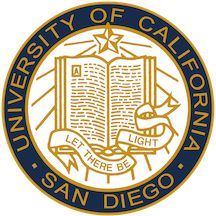

## Computer Science at UC San Diego

I'm currently a second year computer science major at UC San Diego. So far, I've enjoyed the CS curriculum and all the classes I've taken, both the theory and practical ones. All of the faculty I have interacted with have been great and immensely valuable for my education in computer science thus far. 
Some of my favorite CS courses at UCSD so far have been:
- **CSE 30 — Computer Architecture**
- **CSE 100 — Advanced Data Structures**
- **CSE 101 — Algorithms**
- **CSE 12 — Data Structures and OOP**
- **CSE 15L — Software Tools and Techniques**
  
> Note: This list is in no particular order

 

PS: I hope CSE 110 will be on this list by the end of the quarter :)

   

&emsp; &emsp; &emsp; &emsp; &emsp; &emsp; &emsp; &emsp; &emsp;